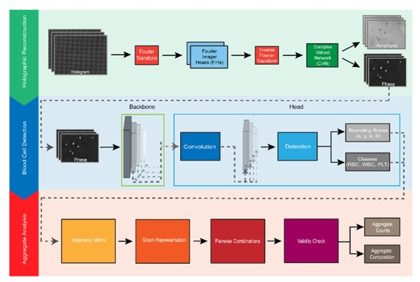

# RT-HAD – Real-Time Holographic Aggregate Detector

_Real-time Image Capture ▶ Reconstruction ▶ Object Detection ▶ Result Storage_

RT-HAD is an end-to-end, microscope-agnostic framework for quantitative phase imaging that processes raw holograms into immediately actionable blood-cell analytics by chaining two purpose-built neural modules: OAH-Net, a physics-consistent CNN that performs learnable Fourier filtering, inverse propagation and phase un¬wrapping to reconstruct high quality and resolution amplitude/phase  images and a hybrid YOLOv8x-p2/graph object detector that operates on a high-resolution P2 head to localise blood cells as representing each cell in the graph to identify blood cell aggregate formation. The framework runs concurrently during sample measurement at the microscope while holograms are acquired (>100 FPS) to outputs blood cell typing and counts with blood cell aggregate quantification that raw data is not retained but clinically relevant cells of interests are stored. 

---

## ✨ What RT-HAD Does
1. 📷 Reconstructs holograms into amplitude & phase images	
2. 🔍 Detects all blood cells (erythrocytes, leukocytes, platelets) in a single forward pass	
3. 🕸️ Builds a spatial graph to recognise platelet and leukocyte aggregates	
4. ⚡ On-the-fly/real-time analysis for ultrafast turn-around time (≤ 10 ms per frame at 105 FPS)	
5. 🛠 Microscope-agnostic—compatible with quantitative phase imaging microscopy with no to little architectural modification (however, you might need to train/fine-tune with your own data)	

---

## 🏗 Architectural Overview



Total latency: ≤ 10 ms, buffered to guarantee zero frame-drop.

---

## 📊 Module-at-a-Glance

| **Module**        | **Backbone / Key Layers**                      | **Output**                        | **Inference (ms)†** | **Notes**                            |
|------------------|-----------------------------------------------|-----------------------------------|----------------------|--------------------------------------|
| **OAH-Net**       | Fourier-Imager-Head → Phase-unwrap             | Amplitude & Phase                 | ~4                   | Physics-guided; no hallucinations    |
| **YOLOv8x-p2**    | CSPDarknet-53 + C2f blocks + P2 head (stride 4) | Bounding boxes & class labels     | ~5                   | Optimised for small objects          |
| **Graph Builder** | Adjacency graph + distance matrix              | Aggregate labels + counts         | ~0.5                 | GPU-accelerated optional             |
| **Whole pipeline**| —                                             | CSV + annotated images / JSON     | ≤ 10                 | 105 FPS sustained                    |

†Measured mean inference speed over 10,000 frames on NVIDIA RTX 4090 with FP16 quantization by TensorRT

---


## 🧩 0 ▪ Workflow

1. 🖥️ **Image Capture:** Images are captured using the **Spinnaker SDK**, which provides a robust interface for camera operations and image acquisition.
2. 🌀 **Image Reconstruction:** Captured images are enhanced using an **AI-based reconstructor** for improved quality and further processing.
3. 🧠 **Object Detection:** A YOLO-based object detection model identifies and classifies objects within the reconstructed images.
4. 🌐 **Data Storage:** Final results are stored in a **containerized HDF5 file**, ensuring organized access to all outputs.

---

## ⚙️ 1. Prerequisites

| Component         | Version Tested   | Notes                        |
|------------------|------------------|------------------------------|
| **Python**        | 3.8               | Python                     |
| **CUDA + cuDNN**  | 11.x / 8.x        | GPU with ≥8 GB recommended   |
| **PyTorch**       | ≥ 2.1             | Install first, CUDA-matched |

---

## 🚀 2 ▪ Installation

> **Note:** Use **Python 3.8** and create a new virtual environment with it.

### Step-by-step Instructions

```bash
# 1️⃣ Create and activate environment
python -m venv .venv
.venv\Scripts\activate   # for Windows
source .venv/bin/activate  # for Linux/macOS

# 2️⃣ Install Spinnaker SDK (PySpin)
python -m pip install spinnaker_python-2.7.0.128-cp38-cp38-win_amd64.whl

# 3️⃣ Install general dependencies
pip install -r requirements.txt

# 4️⃣ Install YOLO
pip install ultralytics

# 5️⃣ Install PyTorch
# Visit https://pytorch.org/ and select your configuration
pip install torch torchvision torchaudio --index-url https://download.pytorch.org/whl/cu118

# Verify PyTorch
python -c "import torch; print(torch.__version__)"
```

---

## 📦 3 ▪ Usage

### A. Starting the Application

- Navigate to `dhm/views/`
- Run `main_view.py`
- If installation is correct, the **GUI** should appear

### B. Configuration Setup

1. Click the **“Configuration”** button.
2. In the popup form:
   - Enter values for required parameters (e.g., `pixel_format`, `exposure_seconds`)
   - Provide paths for:
     - YOLO weight file
     - AI reconstructor models
     - Output folder
3. Click **“Save Configuration”** to store settings.

### C. Analyzing h5 Capture Files

1. Click **“Process Capture File”**
2. Select `.h5` file using **“Select File”**
3. Choose reconstruction method: **Ovizio** or **AI**
4. Click **“Process File”**
5. If successful, results will be saved as a `.h5` container file

### D. Analyzing Reconstructed PNG Images

1. Provide the folder path to PNG phase images
2. Click **“Process File”**
3. Results will be saved as `.h5` container file (if successful)

### E. Previewing Microscope Images

- Click **“Preview Images”** to start real-time hologram image preview

### F. Configure Paths

Ensure the following are correctly updated in your config:

- `VALID_H5_PATH` → path to H5 capture file
- `INPUT_PATH` → path to Ovizio PNGs
- `VALID_IMG_PATH`, `VALID_WEIGHT_PATH` → for detection input

---

## 📝 4 ▪ Notes

- Double-check **device compatibility** when installing PyTorch (e.g., CUDA version)
- Download Spinnaker SDK here https://www.teledynevisionsolutions.com/products/spinnaker-sdk/?model=Spinnaker%20SDK&vertical=machine%20vision&segment=iis
- Ensure **Spinnaker SDK** is properly installed and the `.whl` matches Python version

---

## 📑  Citation

@article{delikoyun2025rthad,

  title  = {XXX},

  author = {Delikoyun, K. *et al.*},

  journal= {XXX},

  year   = {2025}
  
}

---

## 🌐 DataSets To download

1. https://zenodo.org/records/15338907
